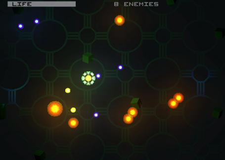
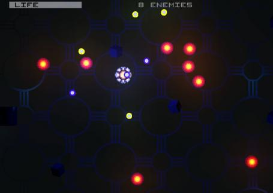
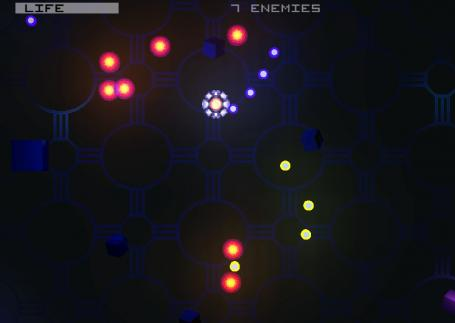
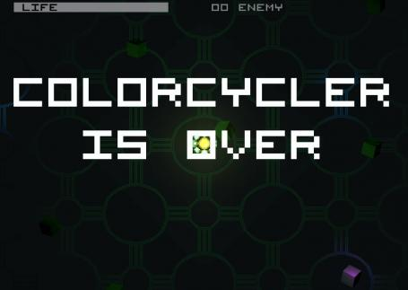

CO-CY (Color Cycler)
====================

Game project created for the Global Game Jam 2014, Isart Digital, Paris.

_**CO-CY** is an arena shoot them up. Use your three scanners to reveal hidden enemies, but be careful, because each one of them hides one type of enemy. For example, the blue scanner hides blue enemies, etc. Use them wisely to survive._

This game was entirely created within 48h, during the GGJ held in [Isart Digital School](https://www.isart.fr/), Bastille, Paris.
4 people contributed to this developpement, in charge of the programming, 2D art, game design, level design, music and sound FX.
Runs only on MS Windows platform, based on the GameStart3D framework.

**Jam Site:** Global Game Jam Paris - ISART DIGITAL 
**Jam year:** 2014 
**Platforms:** MS Windows 

**Credits:** 
- François Gutherz : Programing
- Clément Anelli : Music / Sound Design
- Douglas Alves : Game Design / Graphics
- Florian Dufour : Game Design / Level Design

